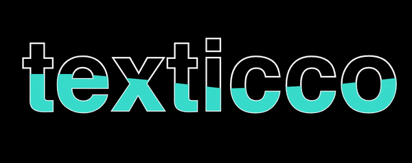
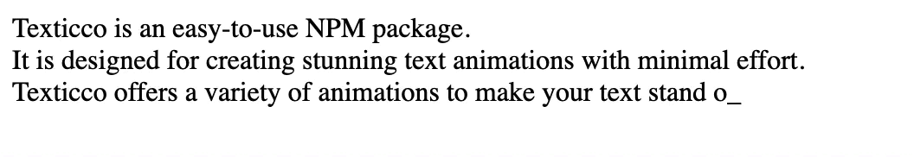
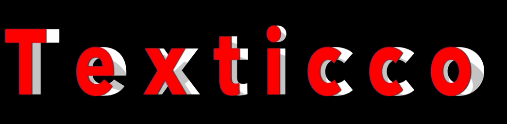
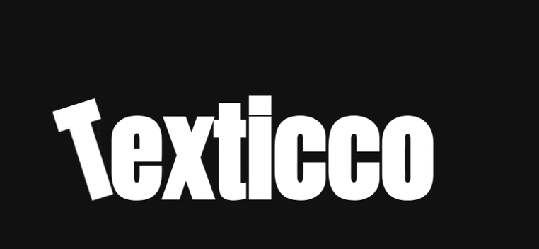

_<h1 style="color:red; font-size:40px; margin-top:0">texticco - Make Your Text Pop with Style</h1>_
---

## Introduction

>[texticco](#) is an easy-to-use **NPM** package designed for creating stunning text animations with minimal effort. Whether you're a web developer looking to add flair to your projects or a designer wanting to enhance user engagement, Texticco offers a variety of animations to make your text stand out.

---

## Key Features

- **Dynamic Animations**: Easily animate your text with a variety of pre-built effects.
- **Performance Optimized**: Enjoy smooth animations without compromising on speed.
- **Cross-Browser Compatibility**: Works flawlessly across all modern browsers.
- **Simple Integration**: Seamlessly integrate Texticco with minimal setup.

---

## <u>Installation</u>

To install texticco, use npm:

```bash
npm install texticco
```

---

## <u>Getting Started</u>

To use Texticco in your project,

- **Import the effect animation from the package as required in Javascript file:**

```javascript
import { Effect_name } from './node_modules/texticco/script.js';
```

---

## <u>Animation Types</u>

-  Wavy text animation ( **WaviTxt** ) 

-  Thunder text animation ( **SparkiTxt** ) 

-  Typing animation ( **TypoTxt** ) 

-  3d folding animation on hover ( **FoldiTxt** ) 

-  3D Dynamic Dance Text Animation on Click ( **SymphoniTxt** ) 

-  Neon text effect animation ( **NeonTxt** ) 

---

## <u>Usage</u> :

<span style="color:red">1. </span>**_WaviTxt_**

<span style="color:red">HTML :</span>

```
<section>
        <div class="content">            
            <h2>texticco</h2>
            <h2>texticco</h2>
        </div>
</section>
```

<span style="color:red">JS :</span>

```javascript
import { WaviTxt } from './node_modules/texticco/script.js';
// Example usage: Initialize with any "Color" of choice
WaviTxt('turquoise');
```

<span style="color:red">Result :</span>



<hr/>


<span style="color:red">2. </span>**_SparkiTxt_**

<span style="color:red">HTML :</span>

```
<canvas id="canvas" style="background-color: black;"></canvas>
```

<span style="color:red">JS :</span>

```javascript
import { SparkiTxt } from './node_modules/texticco/script.js';
// Example usage: Initialize with any "Text",Position on X axis,Position on Y axis 
SparkiTxt("Texticco", 0, 0);
```

<span style="color:red">Result :</span>


<hr/>


<span style="color:red">3. </span>**_TypoTxt_**

<span style="color:red">HTML :</span>

```
<div id="typo"></div>
```

<span style="color:red">JS :</span>

```javascript
import { TypoTxt } from './node_modules/texticco/script.js';

var textArray = new Array(
    "Texticco is an easy-to-use NPM package.",
    "It is designed for creating stunning text animations with minimal effort.",
    "Texticco offers a variety of animations to make your text stand out"
);

// Example usage: Initialize with any 'String ~ Array like above
TypoTxt(textArray);
```

<span style="color:red">Result :</span>



<hr/>


<span style="color:red">4. </span>**_FoldiTxt_**

<span style="color:red">HTML :</span>

```
<p>
    <span data-text="T">T</span>
    <span data-text="e">e</span>
    <span data-text="x">x</span>
    <span data-text="t">t</span>
    <span data-text="i">i</span>
    <span data-text="c">c</span>
    <span data-text="c">c</span>
    <span data-text="o">o</span>
</p>
```

<span style="color:red">JS :</span>

```javascript
import { FoldiTxt } from './node_modules/texticco/script.js';

// Example usage: Call the function with a 'Color' value
FoldiTxt('Red');
```

<span style="color:red">Result :</span>



<hr/>


<span style="color:red">5. </span>**_SymphoniTxt_**

<span style="color:red">HTML :</span>

```
<div class="word">
    <span>T</span>
    <span>e</span>
    <span>x</span>
    <span>t</span>
    <span>i</span>
    <span>c</span>
    <span>c</span>
    <span>o</span>
</div>
```

<span style="color:red">JS :</span>

```javascript
import { SymphoniTxt } from './node_modules/texticco/script.js';

// Example usage: Call the function with a 'Color' value for text 
SymphoniTxt("white");
```

<span style="color:red">Result :</span>



<hr/>


<span style="color:red">6. </span>**_NeonTxt_**

<span style="color:red">HTML :</span>

```
<div class="neon">
    <h1>Texticco</h1>
</div>
```

<span style="color:red">JS :</span>

```javascript
import { NeonTxt } from './node_modules/texticco/script.js';

// Call the function with the desired neon color
NeonTxt("red");
```

<span style="color:red">Result :</span>


<hr/>


## <u>Contributing</u>

Contributions are welcome! If you have an idea for an improvement or a new feature, feel free to open an issue or submit a pull request.

1. Fork the repository.
2. Create a new branch 
    ```bash
    git checkout -b feature-branch
    ```
3. Make your changes and commit them 
    ```bash
    git commit -m 'Add some feature'
    ```
4. Push to the branch 
    ```bash
    git push origin feature-branch
    ```
5. Open a pull request.

---

## <u>License</u>

Texticco is licensed under the [MIT License](LICENSE). See the LICENSE file for more details.
